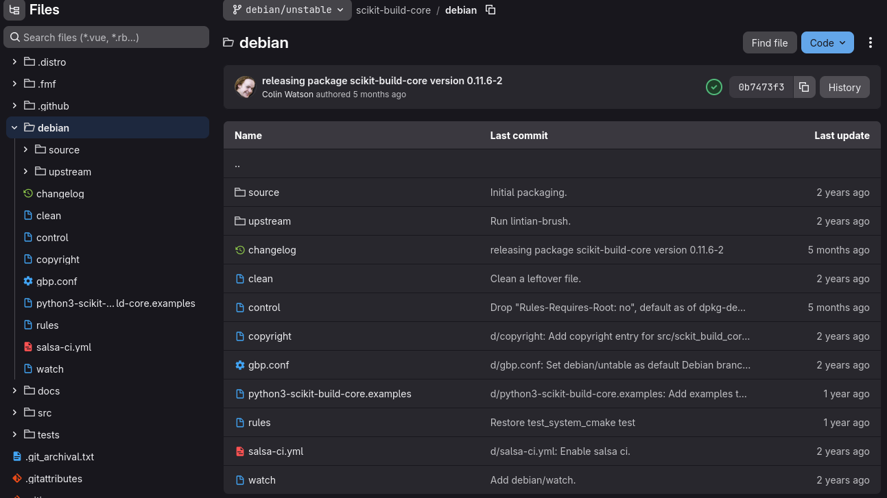
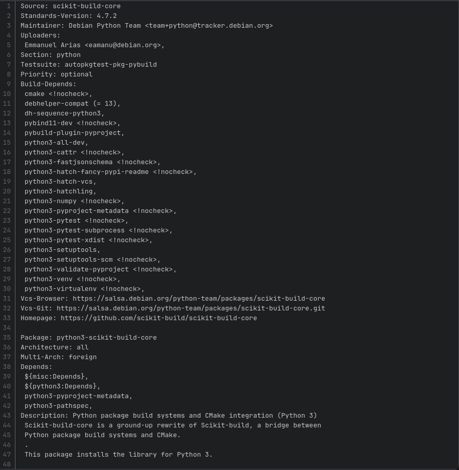

# SIMPLE-Py

## Shipping to distros

---

## Is it still valuable?

- What about `conda`, `spack`, etc.?
  - Does not have extensive testing, vulnerability tracking, etc.
- Is traditional packaging dying?
  - Not for non-gui apps/libraries
  - Still valuable even if you have a flatpak app
- Isn't it a big commitment?
  - Not for you, that's the packager's job
  - Your only job is to be open and communicate

---

## How to get involved

- Run downstream builds/CI in upstream
- Collaborate with a packager

---

# Downstream builds in upstream

All you need is
- `.spec` file: how to build the package
- `packit` app: does the build, shows the result

---

# Downstream builds in upstream

<div class="columns">
<div>

## Spec file metadata
- Mostly boilerplate
- `python3-devel` dependency is enough
- That is it, no maintenance needed

</div>
<div>

```rpmspec
Name:           foo
Version:        0.0.0
Release:        %autorelease
Summary:        Example package
License:        Unlicense
URL:            https://example.com
Source:         %{pypi_source foo}
BuildRequires:  python3-devel

%description
Lorem ipsum
```

</div>
</div>

---

# Downstream builds in upstream

<div class="columns">
<div>

## Build instructions
- Luckily it's a python project
- You can add any bash commands
- But check with packager if there are not simpler methods

</div>
<div>

```rpmspec
%prep
%autosetup -n foo-%{version}

%generate_buildrequires
%pyproject_buildrequires -x test

%build
%pyproject_wheel

%install
%pyproject_install
%pyproject_save_files foo

%check
%pytest
```

</div>
</div>

---

# Downstream builds in upstream

<div class="columns">
<div>

## The rest
- What files you package and where
- `%{pyproject_files}` contains all python files
- `%changelog` don't worry about it

</div>
<div>

```rpmspec
%files -f %{pyproject_files}
%license LICENSE
%doc README.md

%changelog
%autochangelog
```

</div>
</div>

---

<div class="columns">
<div>


## Try it locally

```console
vi foo.spec
packit init
packit build in-mock
```

## In CI

```yaml
specfile_path: foo.spec

jobs:
  - job: copr_build
    trigger: pull_request
```

</div>
<div>

## DIY local build

TBD: what method you want to see?
- Dockerfile?
- Plain rpmbuild?
- MacOS?

</div>
</div>

---

# Shipping to distros


---

# Shipping to distros

## Find your local neighborhood packager

- #scitech:fedoraproject.org
  - (Former?) Scientists involved in distro packaging
- #python:fedoraproject.org
  - Python distro packagers hangout
- #devel:fedoraproject.org
  - Distro packager's water-cooler
- #join:fedoraproject.org
  - Want to become a packager?

---

# What about non-Fedora?



---

# What about non-Fedora?



---

# What about non-Fedora?

## Find your local neighborhood packager

- Where? TBD :)
